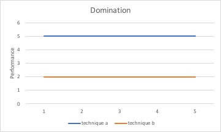
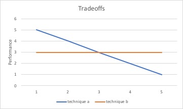

## Some Quotes to Sanity Checks Your Paper

I am fortunate to have recieved a lot of great advice from many great researchers throughout my PhD. As a result, now when I  write a paper (or just present research in general) I often find myself replaying many quotes from the people who taught me how to do research. For me, these quotes/advice serve as a sanity check to ensure that I am actually doing something that makes sense (which at times is much harder than it seems!). Further, when providing feedback on papers, these are the comments I most regularly give. In this post I have compiled the quotes that have stuck with me the most throughout my PhD. This is largerly for myself (so I remember my own sanity checks), but who knows maybe these quotes (sanity checks) will resonate with someone else!

*Note that this post is focused on the presentation of experimental results. If you are interested in how to setup an experiment check out [this post](https://craberger.github.io/coffee/).*

The rest of this post is structured as the following: (1) the quote is provided, (2) the quote is explained, (3) an example of what not to do is provided, and (4) a fix showing what to do is provided.

1. [Show don't tell](#show)
2. [A Paper is Like an Onion](#onion)
3. [Reviewers Use AND Semantics](#and)
4. [Where is the ablation study?](#ablation)
5. [Lines better be crossing](#lines)
6. [A Paper is Not Like a Sitcom, There Should Be No Big Reveal at the End](#sitcom)
7. [You don't get credit for what you didn't do.](#credit)

<a name="show">
## "Show don't tell"

This is a simple one but it's suprising how often it is done wrong. Instead of telling someone how great your idea or result is, let your experimental (or theoretical) results do the talking. Numbers speak louder than words.

### Problem
```markdown
In this paper we present System X and show that it 
performs well on task Y. 
```

The lack of precision is the problem with the writing above. It basically reads like 'We present System X and boy it feels good! It is unclear what 'performs well' means and no baseline is specified. This can setup false expectations for a reader. What 'performs well' is open to interpretation. This may mean at least an order of magnitude to the reader but your results show a 2x improvement.  

### Fix
```markdown
In this paper we present System X and show that it can 
outperform baseline Z by up to 10x at task Y while 
remaining within 10% of Z on tasks A, B, and C. 
```

This statement is precise and not open to interpretation. Further, the reader knows exactly what to expect in the experiments section of the paper. Of course, we should know what 10x is with respect to...but in the hopes of keeping this post generic.

<a name="onion">
## "A Paper is Like an Onion"

Alright now we are getting more out there! This quote refers to the structure of a paper---it should always be parallel in nature. In general the outline of your paper should unravel like the layers of an onion. One thing that is useful for this is setting up your introduction in (roughly) a structure that mirrors the rest of your paper. An easy place to do this is in the contributions. Let's take a look at an example outline.

### Problem
```markdown
1. Introduction (Contributions)
- We present an optimizer to automatically select 
  among techniques.
- We show that two new techniques can lead to 
  speedups in different scenarios.
- We present theory to show our new techniques are 
  principled.
2. Background.
3. Theory
4. Techniques
5. Optimizer
6. Experiments
- End-to-end Comparison
- Micro Experiments Validating Optimizer
```
No parallel structure between the contributions and remainder of the paper! With this structure it is hard for the reader to expect what will come in what order.

### Fix
```markdown
1. Introduction (Contributions)
- We derive a new bound showing that techniques A and 
  B can lead to asympotic speedups.
- We present two new techniques, (1) A and (2) B, and 
 an optimizer to optimally select between them. We 
 show that A can lead to X speedups in scenario C. We
 show that B can lead to X speedups in scenario D.
- We evaluate System X and show that it can outperform 
 baselines A, B, C on tasks D, E, and F. We show that 
 our novel optimizer can provide up to X speedup on 
 these tasks.
2. Background.
3. Theory
4. Techniques
5. Optimizer
6. Experiments
- End-to-end Comparison
- Micro Experiments Validating Optimizer
```

The contributions structure mirrors the rest of the paper!

<a name="and">
## "Reviewers Use AND Semantics"

The 1000 things you do right in a paper do not matter, but the one thing you get wrong does. I most often screwed this up when I tried to do too many things at the paper at the cost of doing a couple things really well. If you are going to present something you better make sure there aren't any holes, otherwise you should refocus your claims.

### Problem
```markdown
We present technique X and show it is the best at 
tasks A, B, C, and D. 
```
Of course there is no problem here if due dillegence has been done on validating technique X on tasks A, B, C, and D but you have to make sure that is true. Also, saying something is the best is bold claim! Were all of the proper baselines considered? Was the experimental setting fully optimized? Did you tune all the parameters of your experiment fully? Did you review the right literature and existing techniques? This is a lot of work, and in this setup you just multiplied it by 4! 

### Fix
```markdown
We present technique X and show it under conditions Y 
and Z it can lead to a 30% improvement on task A 
while recovering state-of-the-art performance on 
task W. 
```

It is better to do one thing well and explain that thing precisely than do many things half-heartedly while making vague claims. Go deep and fully understand one thing before jumping onto another.

<a name="ablation">
## "Where is the ablation study?"

The idea of an ablation study is simple yet effective one: on important tasks break down and isolate the benefit every contribution you make in the paper. This idea is best explained through example:

### Problem
```markdown
Contributions:
-In this paper we present optimizations A, B, and C,
showing that they can lead to a 1000x performance 
advantage when compared to a design not implementing 
these techiniques.

Experiments Table:

        | Performance
        ______________
Task 1  |   10s
Task 2  |   20s
Task 3  |   30s
```

This is great but does what you present in the paper actually matter here? What happens without your optimizations?

### Fix
```markdown
Contributions:
-In this paper we present optimizations A, B, and C, 
showing that they can lead to a 1000x performance 
advantage when compared to a design not implementing 
these techiniques.

Experiments Table (-A means without optimization A):

        | Performance |  -A   |  -B     |  -C   
        _____________________________________
Task 1  |   10s       |  102s |  1003s  |  54s
Task 2  |   20s       |  202s |  2003s  |  64s
Task 3  |   30s       |  302s |  3003s  |  74s
```

I got this one wrong a lot early on but the idea is simple: if you present some optimizations, you better validate their impact on all of the important applications you run in the paper!  

<a name="lines">
## "Lines better be crossing"

This is probably the most important point for systems related papers. I am firm believer that, given the rapidly evolving pace of software and hardware systems, it is likely that no one is really going to care about how you built your system 10 years from now. What people will care about are the tradeoffs. Tradeoffs age well, systems hacks do not. When lines cross in a plot that indicates that there is a tradeoff. 

### Problem


```markdown
Technique A always wins.
```

This is probably useful for a company, but is not as interesting in research. Constant factor optimizations are not that interesting. Tomorrow there will be a new one. Even worse, someone should rightfully be skeptical of these results because there rarely is a free lunch. It is much stronger to point out both where something works well and also where some other techniques are better. This is a common tradeoff that leads to one building an optimizer to automatically select the right technique to run in different settings.

### Fix


```markdown
Technique A wins under conditions X while Technique B 
wins under conditions Y. We build a simple optimizer 
that automatically selects between these techniques 
based on the current condition.
```

Tradeoffs are the interesting thing. There is rarely is such a thing as a free lunch.

<a name="sitcom">
## "A Paper is Not Like a Sitcom, There Should Be No Big Reveal at the End"

Many times I found myself wanting to write a paper like a narrative where I built up some exciting story that all lead to a mind-blowing conclusion or result. This is wrong. The truth of the matter is that most people are not patient and, as a general rule of thumb, they want to know if this section/paragraph/paper is worth reading before actually reading it. There is nothing wrong with this, it is just human nature. So to combat this, the best results should always come first. This is true in every section of the paper. In your abstract/introduction/contributions/experiments the best result should come first and should come often. It should be beaten over people's heads so that they cannot miss it. Let's take a look at two outlines for an experiments section, one that does not ensure this and one that does: 

### Problem
```markdown
Experiments:
-Micros (Ablation Study)
-Macros (End-to-End Comparison)
```
Why would I care about your ablation study if I did not know its overall impact is when compared to the state-of-the-art? This is what the macros are for!

### Fix
```markdown
Experiments:
-Macros (End-to-End Comparison)
-Micros (Ablation Study)
```

In this setup the reader is motivated to read the micros section because they understand its impact from the macros.

<a name="credit">
## "You don't get credit for what you didn't do."

I got burned by this one in my first paper. I thought I could just write my way around why I did not setup an experiment. Well, I learned that hard way that you cannot! If there is some experiment that can improve you paper drastically it should always be added in. Even if this experiment does not become a central contribution that appears in the paper, there is value in placing results in an appendix.

### Problem
```markdown
We test technique A under conditions X and Y. 
We omit a comparsion on technique Z because it
rarely occurs.
```

Reviewers are very good at pointing out your laziness!

### Fix
```markdown
We test technique A under conditions X and Y. We 
present a comparsion on technique Z in the 
Appendix on conditions that we rarely encountered 
in practice.
```

This goes back to show don't tell! Better to withhold a paper that could be made better than hurry into a rushed submission. Also, it is the best feeling in the world when a reviewer asks for an experiment that you already did in the appendix.
